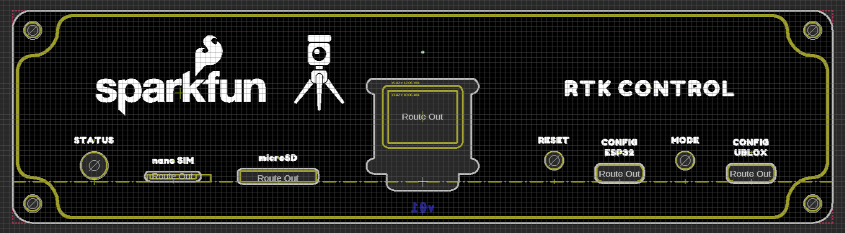
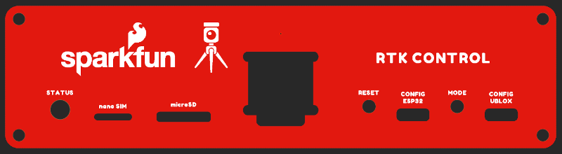

SparkFun Enclosure Panel Library for Eagle
========================================

<table class="table table-hover table-striped table-bordered">
  <tr align="center">
   <td></td>
  <tr align="center">
    <td><a href="https://www.sparkfun.com/products/22640">SparkFun Metal Enclosure - Custom Aluminum Extrusion (6x4in. PCB) (PRT-22640)</a></td>
  </tr>
</table>

While we were developing the [RTK Reference Station](https://www.sparkfun.com/products/22429), we wanted to be able to quickly prototype the front and rear panels for the new [extruded aluminium enclosure](https://www.sparkfun.com/products/22640).
This was to allow us to check the dimensions of the holes and cut-outs, before we committed to having the panels machined from aluminium.
Instead of trying to machine the prototype panels in house, we designed them as PCBs and had our usual fab house make them for us.
We were so delighted with the results that we thought we'd share the technique - open-source naturally - so you can have your own panels made.

This Eagle library contains the holes and cut-outs for:

* 5mm right angle LED (LED-RIGHT-ANGLE-PTH-GREEN (LED-RIGHT-ANGLE-PTH), DIO-13847)
* microSD socket (push-push) (MICRO-SD-PUSH-PUSH-EXT-PIN (MICRO-SD), CONN-16110)
* [Micro OLED breakout](https://www.sparkfun.com/products/14532)
* Momentary switch (MOMENTARY-SWITCH-SPST-PTH-RIGHT-ANGLE-8-020 (MOMENTARY-SWITCH-SPST), SWCH-13896)
* [USB-C socket](https://www.sparkfun.com/products/15111) (USB_C_4-LAYER_PADS (USB_C), CONN-14122)
* [Edge-mount SMA connector](https://www.sparkfun.com/products/593) (ANTENNA-SMA-GROUNDEDEDGE_SMA (ANTENNA-SMA-GROUNDED), CONN-08289)
* [Edge-mount SMA RP connector](https://www.sparkfun.com/products/592) (ANTENNA-SMA-GROUNDEDEDGE_RPSMA (ANTENNA-SMA-GROUNDED), CONN-00827)
* [10-way 3.5mm header](https://www.sparkfun.com/products/22461) (CONN_10_3.5MM_RA_HEADER (CONN_10), CONN-17279)
* Ethernet mag jack (PoE) (MAGJACK-POE, CONN-16253)
* Nano SIM socket (push-push) (NANO_SIM_PP, CONN-16272)

How To Use
-------------------

The library contains the holes and cut-outs as standard Eagle parts. Each part has both a symbol and a 'footprint'. You don't really need the schematic symbols but we included them anyway.

The 'footprints' are all referenced to the top surface of the PCB. Align the origins horizontally, space them according to your design, and go get your panels made!

You will find the panels we designed for the Reference Station on the [enclosure product page - documents tab](https://www.sparkfun.com/products/22640)
and also on [GitHub](https://github.com/sparkfun/SparkFun_RTK_Reference_Station/tree/main/Front_Panel).
If you want to design your own stickers, you will find those on [GitHub](https://github.com/sparkfun/SparkFun_RTK_Reference_Station/tree/main/Front_Panel_Sticker) too.

License Information
-------------------

This product is _**open source**_! 

Please review the LICENSE.md file for license information. 

If you have any questions or concerns on licensing, please contact technical support on our [SparkFun forums](https://forum.sparkfun.com/viewforum.php?f=152).

Distributed as-is; no warranty is given.

- Your friends at SparkFun.
